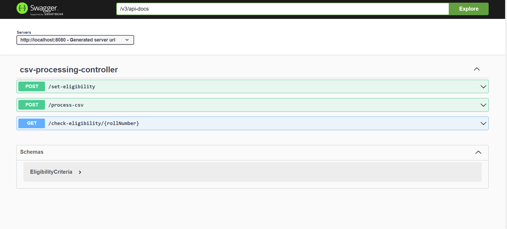

# Natwest

---

## Overview
This project is a CSV processing application built using Spring Boot. It processes CSV files containing student data, checks their eligibility based on predefined criteria, and stores the results in a database. The application utilizes microservices architecture, multithreading, and Swagger for documentation.

## Features
- **CSV Processing:** Upload CSV files containing student data for processing.
- **Eligibility Check:** Check eligibility of students based on predefined criteria such as marks in specific subjects.
- **Database Storage:** Store the processed data in a database.
- **Multithreading:** Process multiple CSV files simultaneously using multithreading for improved performance.
- **Swagger Documentation:** Explore and test the APIs using Swagger UI.

## Microservices
The project consists of the following microservices:
1. **CSV Processing Service:** Responsible for processing CSV files and checking eligibility.
2. **Database Service:** Manages the storage of student data in the database.
3. **Eligibility Service:** Defines and manages eligibility criteria for students.

## Usage
1. **Upload CSV Files:** Use the provided endpoints to upload CSV files containing student data.
2. **Check Eligibility:** Invoke the eligibility check API to determine the eligibility of students based on predefined criteria.
3. **View Results:** Access the database to view the processed student data and their eligibility status.

## CSV Data
Here, there are 3 sample CSV files attached with project, each containing 2000 records of student data. Ensure that the CSV files adhere to the expected format for successful processing.

## Technologies Used
- Spring Boot 3
- H2 Database
- Swagger

## Getting Started
To run the project locally:
1. Clone the repository.
2. Navigate to the project directory.
3. Build and run the individual microservices.
4. Access the Swagger UI to explore and test the APIs.

## Version
- Spring Boot 3

---

H2 Database
Swagger
Getting Started
To run the project locally:

Clone the repository.
Navigate to the project directory.
Build and run the individual microservices.
Access the Swagger UI to explore and test the APIs.
# Version
Spring Boot 3
